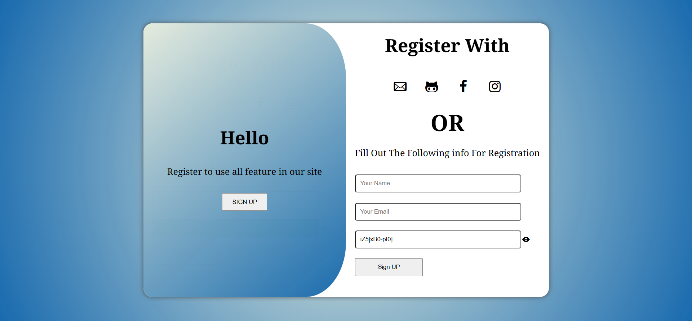
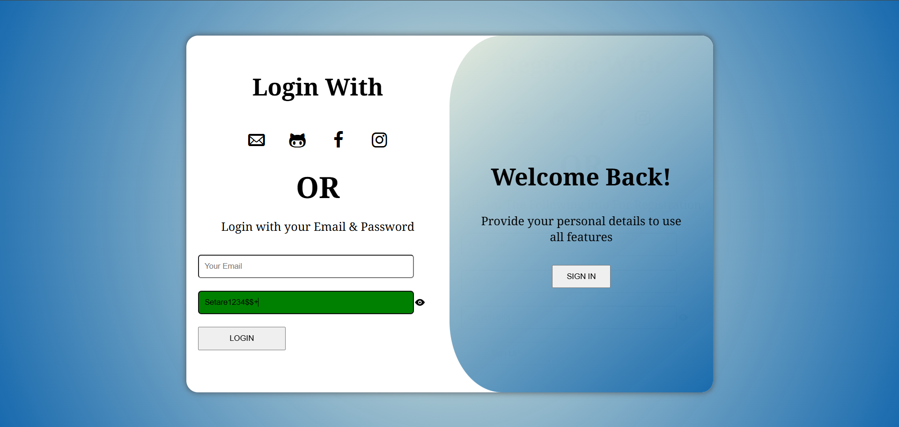

# Login & Registration Form

A simple **Login & Registration form** project with client-side validation, password visibility toggle, password strength indicator, and random password generator.

> ⚠️ **Note:** This project is **not responsive** and works best on desktop screens.

---

## Features

- Form validation for email and password.
- Password visibility toggle using the eye icon.
- Password strength indicator with color feedback.
- Random password generator (12 characters) with uppercase, lowercase, numbers, and symbols.
- Animation for switching between login and registration forms (after box animation).

---

## JavaScript Methods & Techniques Used

- `document.getElementById()` & `document.querySelector()` → Selecting DOM elements
- `.addEventListener()` → Handling events
- `.innerHTML` / `.innerText` → Updating text dynamically
- `.style` → Inline CSS manipulation
- `Math.random()` & `Math.floor()` → Random password generation
- `String.prototype.search()` → Regex pattern checking
- `if / else` statements → Validation logic
- `%` operator → Distribute character types in password
- `event.preventDefault()` → Prevent form submission on validation failure
- `setTimeout()` → Animate text changes
- Toggle counters (`num`, `num2`, `btnclick`) → Control password visibility and after-box animation

---
## Screenshots

---
## Demo

[View Live Demo](#)  

---

## How to Use

1. Open `index.html` in your browser.
2. Enter a valid email and password.
3. Click the eye icon to show/hide the password.
4. Observe the password strength indicator while typing.
5. Use the random password generator to create a strong password.
6. Click **SIGN IN / SIGN UP** to switch forms with animation.

---

## Notes

- JavaScript must be enabled for full functionality.
- This project is **not mobile-friendly**.
- Random password uses lowercase, uppercase, numbers, and symbols.
- Validation prevents basic malicious input such as `<script>` tags.
